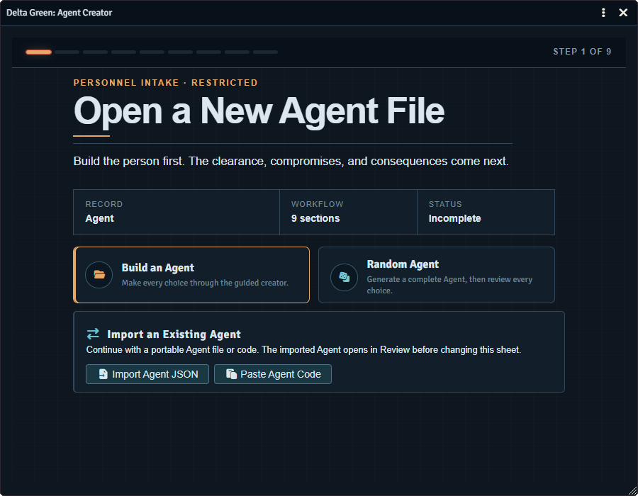
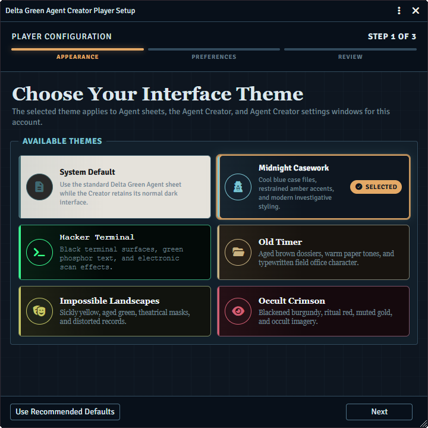
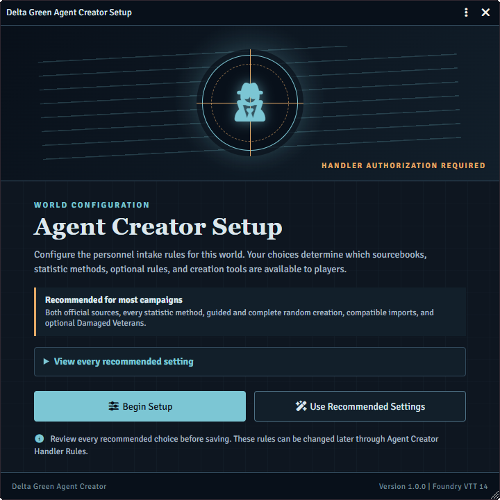
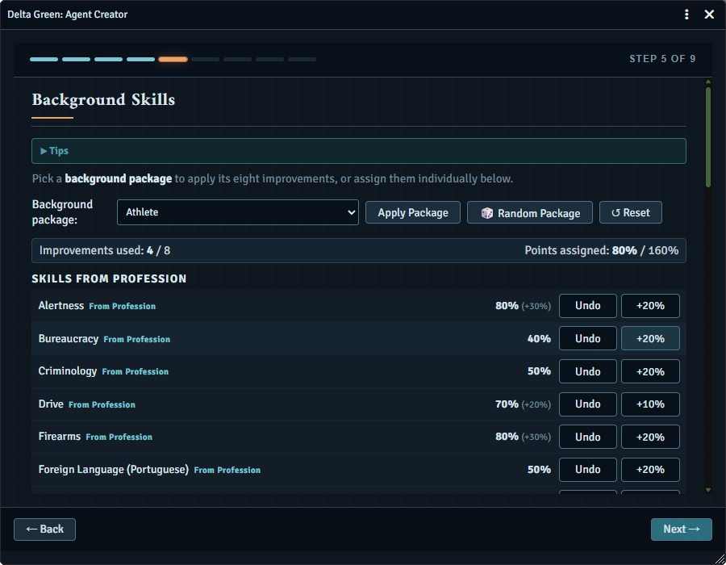
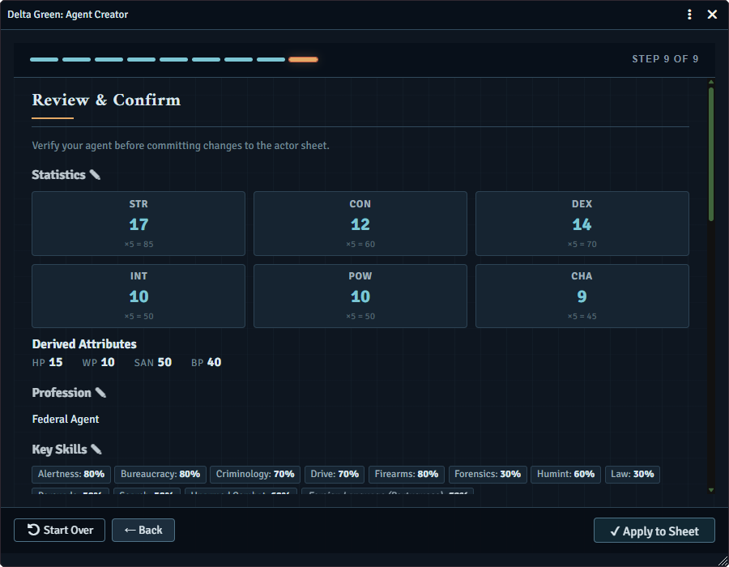

# Delta Green Agent Creator

A guided and randomized Agent creation module for Foundry Virtual Tabletop and the Delta Green system.

Build complete Agents through a structured nine section workflow, generate a complete random Agent, or transfer an Agent between worlds with portable JSON files and compact Agent Codes.



## Features

* Guided Agent creation with automatic draft saving and exact final review
* Complete Random Agent generation with review before anything changes on the Actor
* Professions from the Agent's Handbook, The Complex, and the Need to Know quickstart
* Custom professions when enabled by the Handler
* Generalist, Focused, Highly Focused, rolled, 72 point allocation, and randomized statistics
* Professional skill choices, typed specialties, Background Skill packages, and manual improvements
* Profession appropriate Bonds, Motivations, biography, physical description, and portrait selection
* Optional Damaged Veteran backgrounds with visible mechanical effects
* Per user preferences and a first time Player Setup Wizard
* Handler controlled rules, content sources, creation modes, imports, and randomizers
* Automatic draft recovery when the Creator is closed or Foundry is refreshed

## Interface themes

Each user can choose an interface theme without changing another user's preferences.

* System Default
* Midnight Casework
* Hacker Terminal
* Old Timer
* Impossible Landscapes
* Occult Crimson



Themes apply to Agent sheets, the Agent Creator, and its settings windows. Theme choices can be previewed before saving.

## Agent transfer

Completed Agents can be moved between Actors and worlds using either format:

* Readable Agent Exchange JSON files
* Compact `DGAC1:` Agent Codes suitable for chat or messages

Imported Agents open in Review before the destination Actor is changed. Player imports are checked against the current world's Handler rules.

The versioned interchange format is documented in [Agent Exchange Format](docs/agent-exchange-format.md).

## Installation

### Foundry package installation

Paste this manifest URL into Foundry's Install Module window:

```text
https://github.com/noreaga/delta-green-agent-creator/releases/latest/download/module.json
```

### Manual installation

Download the release ZIP and extract the `delta-green-agent-creator` folder into Foundry's `Data/modules` directory. Restart Foundry and enable Delta Green Agent Creator in the world.

## Getting started

The first GM login opens Handler Setup. Configure the world rules manually or begin with the recommended settings.

Each player receives a separate Player Setup Wizard for their own theme and Creator preferences. These preferences remain isolated by Foundry user.

Open an Agent Actor sheet and select the `Agent Creator` control in its title bar. Existing progress can be resumed, restarted, exported, or reviewed before application.

## Handler controls

The Handler can configure:

* Available profession sources
* Fixed specialty behavior and custom professions
* Allowed and default statistic methods
* Roll visibility
* Required Motivations
* Damaged Veteran availability
* Guided creation and Complete Random Agent access
* Player import policy
* Random Agent Veteran frequency
* Individual guided creation randomizers
* Default Bond suggestion pool

## Compatibility

* Foundry Virtual Tabletop 14.367
* Delta Green system 2.0.1

## Application behavior

Applying an Agent replaces Creator managed statistics, standard skills, typed skills, Bonds, Motivations, biography, physical description, and Damaged Veteran effects. The Creator requests confirmation before replacing an Actor that already contains character data when confirmation is enabled.

Equipment creation is intentionally outside the current workflow.

## Screenshots

<table>
  <tr>
    <th>Handler Setup</th>
    <th>Background Skills</th>
  </tr>
  <tr>
    <td width="50%"></td>
    <td width="50%"></td>
  </tr>
  <tr>
    <th>Review and Confirm</th>
    <th>Themed Agent Sheet</th>
  </tr>
  <tr>
    <td width="50%"></td>
    <td width="50%"></td>
  </tr>
</table>

## Credits

Created and maintained by [Nore](https://github.com/noreaga).

Development assistance was provided by OpenAI Codex, with independent review assistance from Anthropic Claude.

Built for the [Delta Green system for Foundry Virtual Tabletop](https://github.com/TheLastScrub/delta-green-foundry-vtt-system).

## License

MIT © 2026 Nore  
See [LICENSE.md](LICENSE.md).

## Legal

Delta Green is a trademark and copyright of the Delta Green Partnership. Delta Green Agent Creator is an unofficial fan made module and is not affiliated with or endorsed by the Delta Green Partnership. No rulebook PDFs or copyrighted artwork are distributed with this module.
